# FastHTML-CMS User Guide

A complete guide to managing your website with FastHTML-CMS.

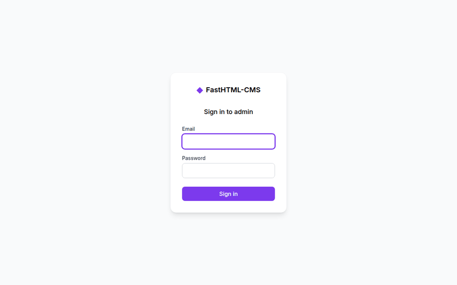

---

## Table of Contents

1. [Getting Started](#getting-started)
2. [Dashboard](#dashboard)
3. [Managing Pages](#managing-pages)
4. [Using the Page Editor](#using-the-page-editor)
5. [Content Blocks](#content-blocks)
6. [Images](#images)
7. [Documents](#documents)
8. [Snippets](#snippets)
9. [Users & Roles](#users--roles)
10. [Site Settings](#site-settings)
11. [Reports](#reports)
12. [JSON API](#json-api)
13. [Keyboard Shortcuts](#keyboard-shortcuts)

---

## Getting Started

### Logging In

Navigate to `/admin/login` and enter your email and password.

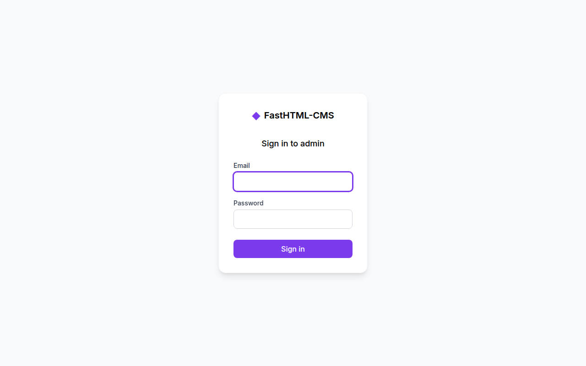

After signing in you'll land on the admin dashboard.

### First Steps

1. Edit the **Home** page content from Pages
2. Upload images to the **Media Library**
3. Configure your site name and contact info in **Settings**

---

## Dashboard

The dashboard gives you an overview of your site at a glance.

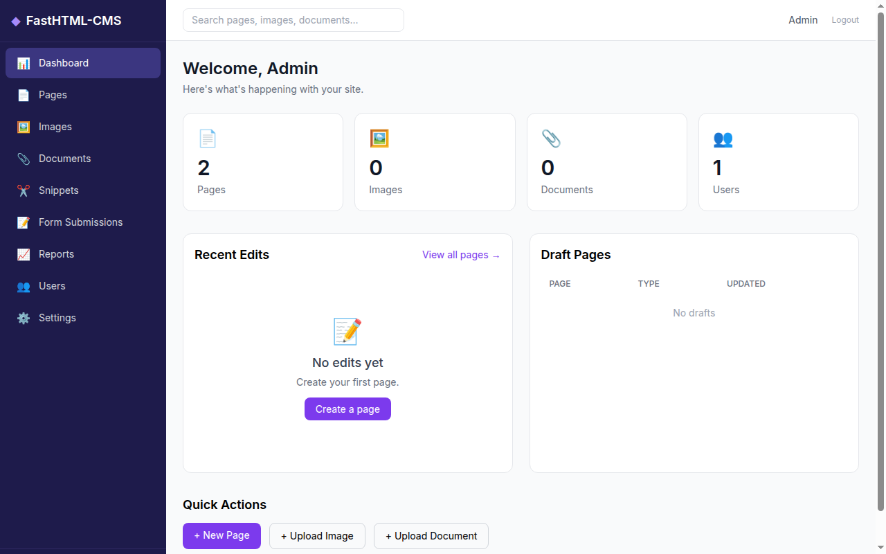

### What You'll See

- **Stats cards** — Total pages, images, documents, and users
- **Recent Edits** — The last 10 pages edited across the site
- **Draft Pages** — Pages saved but not yet published
- **Quick Actions** — Shortcuts to create pages, upload images, and upload documents

---

## Managing Pages

### Page Explorer

Click **Pages** in the sidebar to browse the page tree.

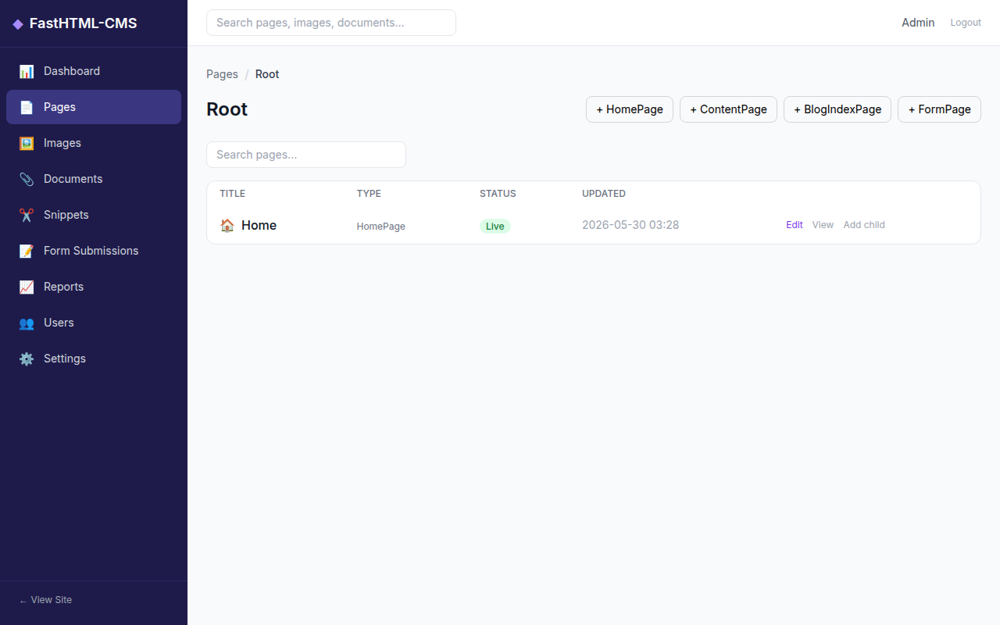

The page explorer shows:
- **Page title** with type icon — click to drill into child pages
- **Content type** — HomePage, ContentPage, BlogPage, etc.
- **Status badge** — Live (green), Draft (gray), Live + Draft (amber), Scheduled (blue)
- **Last updated** timestamp
- **Actions** — Edit, View (live pages), Add child

### Creating Pages

Click one of the **+ PageType** buttons at the top of the explorer. Available page types depend on the parent page:

| Parent Type | Allowed Children |
|-------------|-----------------|
| RootPage | HomePage, ContentPage, BlogIndexPage, FormPage |
| HomePage | ContentPage, BlogIndexPage, FormPage |
| ContentPage | ContentPage, FormPage |
| BlogIndexPage | BlogPage |

### Page Operations

From the page editor's action menu (bottom-right dropdown):
- **Save Draft** — Save without publishing
- **Publish** — Make the page live on your site
- **Unpublish** — Remove from the live site (keeps content)
- **Lock/Unlock** — Prevent other editors from making changes
- **View Revisions** — See edit history and restore previous versions
- **Delete** — Permanently remove the page and its children

### Moving & Copying Pages

Use the Move and Copy actions to reorganize your page tree. Moving a page updates all URL paths automatically.

---

## Using the Page Editor

The page editor has three tabs:

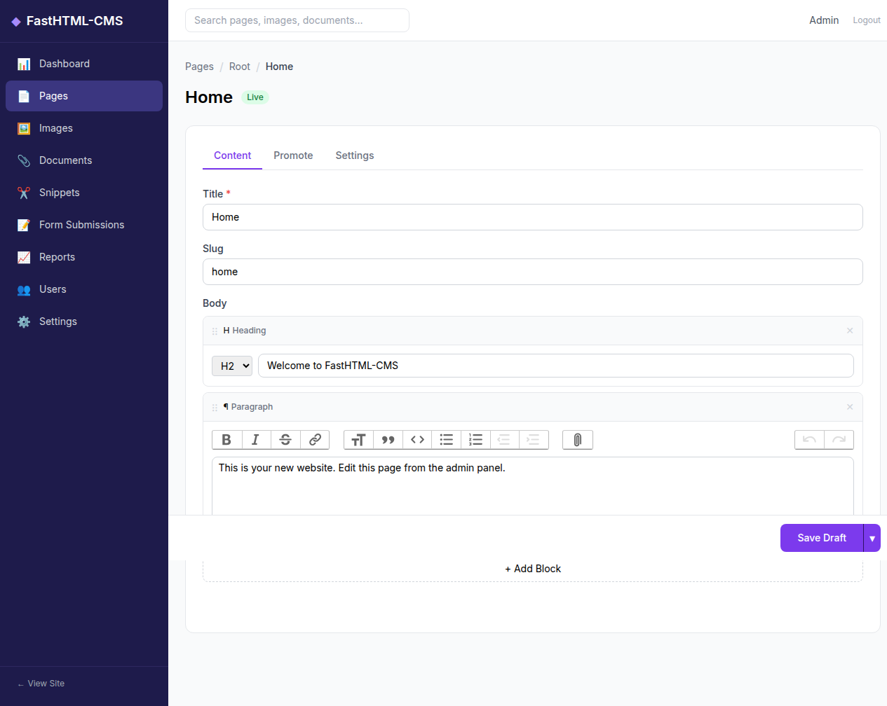

### Content Tab

- **Title** — The page heading (required). The slug auto-generates as you type.
- **Slug** — The URL segment for this page (e.g., `about-us` becomes `/about-us/`)
- **Body** — StreamField content blocks (see below)
- **Type-specific fields** — BlogPage has date/author/tags; FormPage has intro/thank-you text

### Promote Tab


- **SEO Title** — Override the page title in search engine results
- **Search Description** — Meta description shown in search results

### Settings Tab

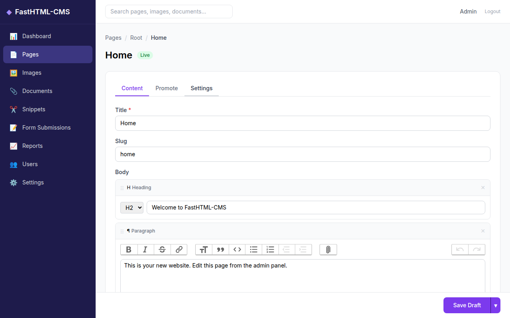

- **Go Live Date/Time** — Schedule when the page becomes live
- **Expiry Date/Time** — Schedule when the page is automatically unpublished
- **Show in Menus** — Include this page in site navigation
- **Page Info** — Type, URL, creation date, and current status

---

## Content Blocks

The body of every page uses a **StreamField** — a flexible list of content blocks that you can add, remove, and reorder.

### Available Block Types

| Block | Icon | Description |
|-------|------|-------------|
| **Heading** | H | Heading text with level selector (H2, H3, H4) |
| **Paragraph** | &para; | Rich text with formatting toolbar (bold, italic, links, lists) |
| **Image** | &image; | Choose an image with caption and alt text |
| **Embed** | &blacktriangleright; | Embed video or rich content via URL and HTML |
| **Quote** | &ldquo; | Blockquote with attribution |
| **Code** | <> | Code snippet with language syntax highlighting |
| **List** | &equiv; | Ordered or unordered list |
| **Table** | &boxplus; | Data table with headers and rows |
| **Document** | &paperclip; | Link to an uploaded document |
| **Raw HTML** | {} | Raw HTML for advanced embeds (admin only) |

### Working with Blocks

1. Click **+ Add Block** to open the block type chooser
2. Select a block type — the edit form appears
3. **Drag** the &vellip;&vellip; handle to reorder blocks
4. Click **&times;** to remove a block
5. Changes are saved when you click Save Draft or Publish

---

## Images

Click **Images** in the sidebar to manage your media library.

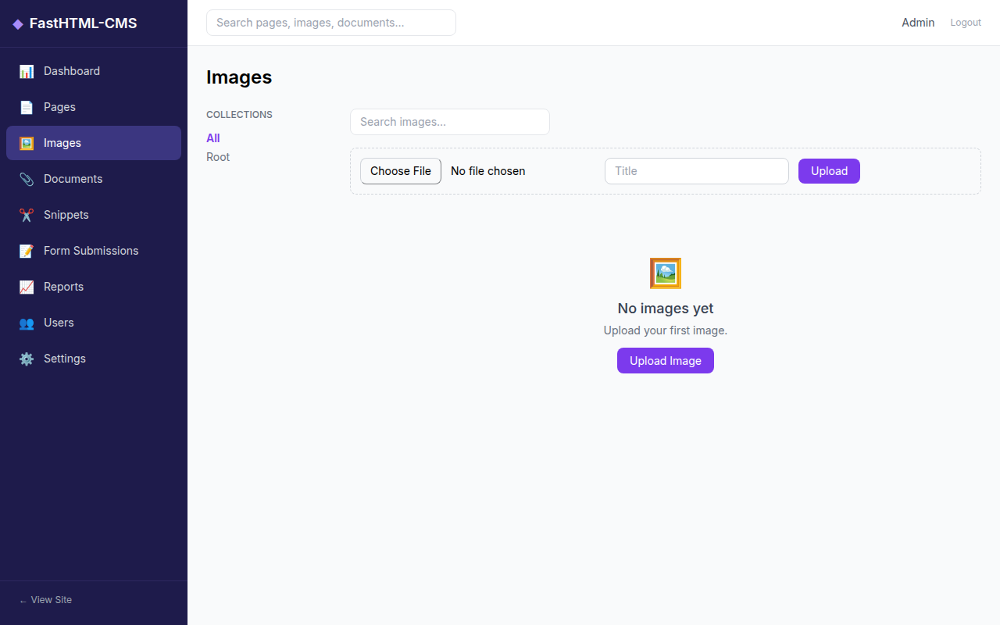

### Uploading Images

Use the upload form at the top of the images page:
1. Click **Choose File** and select an image
2. Enter a **title** for the image
3. Click **Upload**

### Image Features

- **Thumbnails** — Automatically generated in multiple sizes
- **Alt text** — Describe the image for accessibility
- **Tags** — Comma-separated keywords for filtering
- **Collections** — Organize images into groups
- **Focal point** — Set the crop center for thumbnails (x/y coordinates)
- **Usage tracking** — See which pages reference each image

### Image Chooser

When editing a page, click **Choose Image** on an image block to open the chooser modal. You can search, filter by collection, or upload a new image directly from the modal.

### Supported Formats

JPEG, PNG, WebP, GIF, SVG (passthrough). Images are automatically resized for thumbnails using Pillow.

---

## Documents

Click **Documents** in the sidebar to manage file uploads.

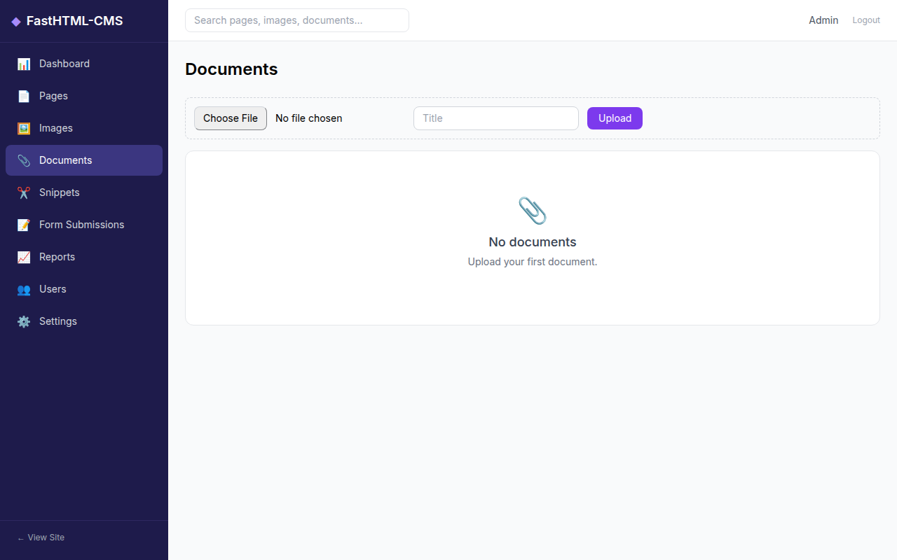

- Upload any file type (PDF, DOCX, XLSX, etc.)
- Organize with tags and collections
- Documents are served with proper Content-Type headers
- Use Document blocks in pages to link to files

---

## Snippets

Snippets are reusable content fragments managed from the admin.

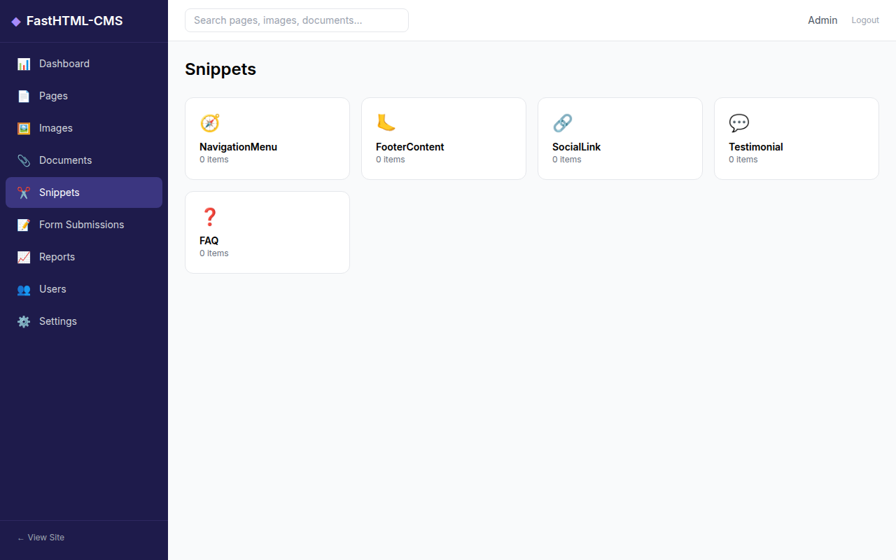

### Built-in Snippet Types

| Type | Purpose |
|------|---------|
| **NavigationMenu** | Site navigation links (stored as JSON) |
| **FooterContent** | Footer column content |
| **SocialLink** | Social media platform + URL |
| **Testimonial** | Customer quotes with name/role |
| **FAQ** | Question and answer pairs |

Click a snippet type to view, add, edit, or delete instances.

---

## Users & Roles

Click **Users** in the sidebar to manage admin users (admin role required).

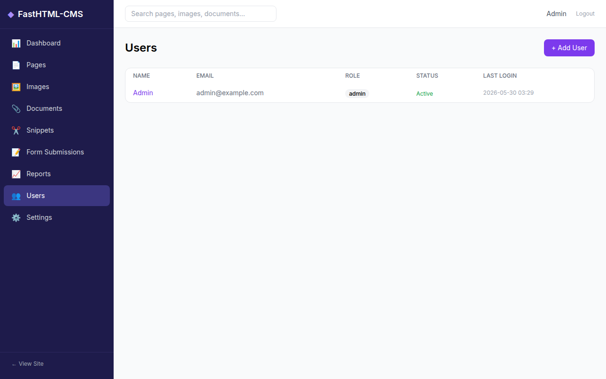

### Roles

| Role | Can Edit | Can Publish | Can Delete | Can Manage Users | Can Manage Settings |
|------|----------|-------------|------------|-----------------|-------------------|
| **Admin** | Yes | Yes | Yes | Yes | Yes |
| **Editor** | Yes | Yes | No | No | No |
| **Moderator** | Yes | No | No | No | No |

### Managing Users

- **Add User** — Set name, email, password, and role
- **Edit User** — Change details, role, or active status
- **Change Password** — Reset a user's password
- **Deactivate** — Disable login without deleting the account

---

## Site Settings

Click **Settings** in the sidebar to configure site-wide options (admin role required).

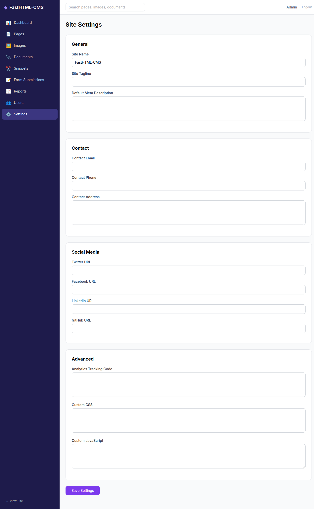

### Setting Groups

**General** — Site name, tagline, default meta description

**Contact** — Email, phone, address (displayed in footer)

**Social Media** — Twitter, Facebook, LinkedIn, GitHub URLs

**Advanced** — Analytics tracking code, custom CSS, custom JavaScript

---

## Reports

Click **Reports** in the sidebar for site analytics and auditing.

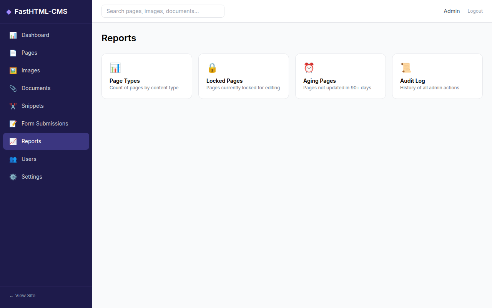

### Available Reports

| Report | Description |
|--------|-------------|
| **Page Types** | Count of pages by content type |
| **Locked Pages** | Pages currently locked for editing |
| **Aging Pages** | Live pages not updated in 90+ days |
| **Audit Log** | Full history of admin actions (create, edit, publish, delete, lock) |

---

## JSON API

FastHTML-CMS provides a read-only JSON API for headless CMS usage.

### Endpoints

| Endpoint | Description |
|----------|-------------|
| `GET /api/v1/pages/` | List published pages |
| `GET /api/v1/pages/{id}/` | Single page with body blocks |
| `GET /api/v1/images/` | List images with rendition URLs |
| `GET /api/v1/images/{id}/` | Single image details |
| `GET /api/v1/documents/` | List documents |
| `GET /api/v1/documents/{id}/` | Single document |
| `GET /api/v1/search/?query=term` | Full-text search |

### Query Parameters (Pages)

- `child_of=5` — Children of page ID 5
- `type=BlogPage` — Filter by content type
- `search=hello` — Full-text search
- `fields=title,body` — Select specific fields
- `order=-first_published_at` — Sort order (prefix `-` for descending)
- `limit=20&offset=0` — Pagination

### Example Response

```json
{
  "meta": {"total_count": 2},
  "items": [
    {
      "id": 2,
      "meta": {
        "type": "HomePage",
        "detail_url": "/api/v1/pages/2/",
        "html_url": "/",
        "slug": "home"
      },
      "title": "Home",
      "body": [
        {"type": "heading", "value": {"text": "Welcome", "level": 2}},
        {"type": "paragraph", "value": {"text": "<p>Hello world</p>"}}
      ]
    }
  ]
}
```

---

## Keyboard Shortcuts

| Shortcut | Action |
|----------|--------|
| `Ctrl+S` / `Cmd+S` | Save draft (in page editor) |
| `Escape` | Close modal dialogs |

---

## Revision History

Every edit creates a revision. To view or restore previous versions:

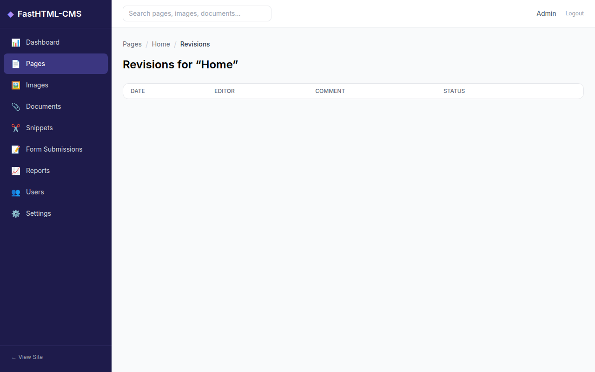

1. Open a page in the editor
2. Click **View Revisions** from the action menu dropdown
3. See the full edit history with timestamps, editors, and comments
4. Click **Restore** to revert to any previous version

---

## Need Help?

- **GitHub**: [github.com/predictivelabs/FastHTML-CMS](https://github.com/predictivelabs/FastHTML-CMS)
- **Built by**: [Predictive Labs Ltd](https://predictivelabs.ai)
